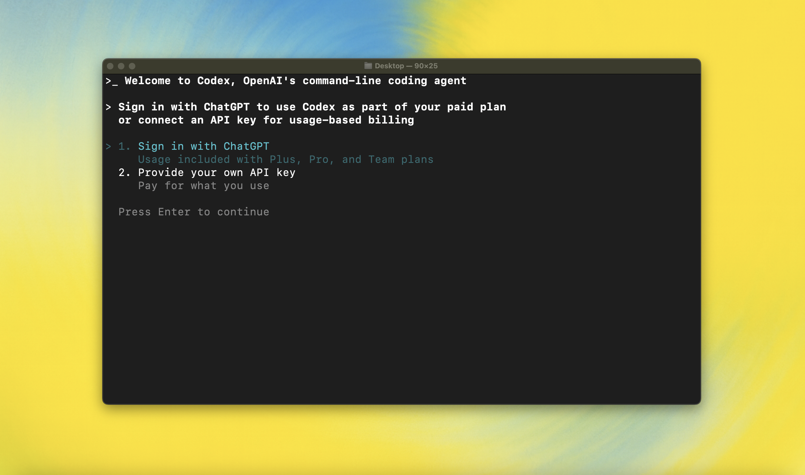

<p align="center"><code>npm i -g @openai/codex</code><br />或 <code>brew install codex</code></p>

<p align="center"><strong>Codex CLI</strong> 是来自 OpenAI 的编码代理，可在您的计算机上本地运行。
</br>
</br>如果您需要帮助或支持使用 Codex，而不是报告错误，请在 [codex/discussions](https://github.com/migrant620/codexCN/discussions) 上发布，您可以在那里提问或与他人就如何改进 codex 的想法进行交流。
</br>如果您正在寻找来自 OpenAI 的<em>基于云的代理</em>，<strong>Codex Web</strong>，请访问 <a href="https://chatgpt.com/codex">chatgpt.com/codex</a></p>

<p align="center">
  
  </p>

---

## 快速开始

### 安装和运行 Codex CLI

使用您首选的包管理器全局安装。如果您使用 npm：

```shell
npm install -g @openai/codex
```

或者，如果您使用 Homebrew：

```shell
brew install codex
```

然后只需运行 `codex` 即可开始：

```shell
codex
```

<details>
<summary>您也可以前往 <a href="https://github.com/migrant620/codexCN/releases/latest">最新 GitHub 发布版本</a> 并下载适合您平台的二进制文件。</summary>

每个 GitHub 发布版本都包含许多可执行文件，但实际上，您可能需要以下其中之一：

- macOS
  - Apple Silicon/arm64: `codex-aarch64-apple-darwin.tar.gz`
  - x86_64（较旧的 Mac 硬件）: `codex-x86_64-apple-darwin.tar.gz`
- Linux
  - x86_64: `codex-x86_64-unknown-linux-musl.tar.gz`
  - arm64: `codex-aarch64-unknown-linux-musl.tar.gz`

每个压缩包都包含一个名称中包含平台信息的条目（例如，`codex-x86_64-unknown-linux-musl`），因此您可能需要在解压后将其重命名为 `codex`。

</details>

### 使用 ChatGPT 计划使用 Codex

<p align="center">
  
  </p>

运行 `codex` 并选择 **使用 ChatGPT 登录**。我们建议您登录到 ChatGPT 账户，以作为您的 Plus、Pro、Team、Edu 或 Enterprise 计划的一部分使用 Codex。[了解您的 ChatGPT 计划中包含的内容](https://help.openai.com/en/articles/11369540-codex-in-chatgpt)。

您也可以使用 API Key 使用 Codex，但这需要[额外设置](./docs/authentication.md#usage-based-billing-alternative-use-an-openai-api-key)。如果您之前使用 API Key 进行按使用量计费，请参阅[迁移步骤](./docs/authentication.md#migrating-from-usage-based-billing-api-key)。如果您在登录时遇到问题，请在[此问题](https://github.com/migrant620/codexCN/issues/1243)中评论。

### 模型上下文协议 (MCP)

Codex CLI 支持 [MCP 服务器](./docs/advanced.md#model-context-protocol-mcp)。通过在 `~/.codex/config.toml` 中添加 `mcp_servers` 部分来启用。

### 配置

Codex CLI 支持丰富的配置选项，偏好设置存储在 `~/.codex/config.toml` 中。有关完整的配置选项，请参阅[配置](./docs/config.md)。

---

### 文档和常见问题

- [**快速开始**](./docs/getting-started.md)
  - [CLI 使用](./docs/getting-started.md#cli-usage)
  - [使用提示作为输入运行](./docs/getting-started.md#running-with-a-prompt-as-input)
  - [示例提示](./docs/getting-started.md#example-prompts)
  - [使用 AGENTS.md 的记忆功能](./docs/getting-started.md#memory-with-agentsmd)
  - [配置](./docs/config.md)
- [**沙盒和批准**](./docs/sandbox.md)
- [**身份验证**](./docs/authentication.md)
  - [身份验证方法](./docs/authentication.md#forcing-a-specific-auth-method-advanced)
  - [在"无头"机器上登录](./docs/authentication.md#connecting-on-a-headless-machine)
- [**高级功能**](./docs/advanced.md)
  - [非交互式 / CI 模式](./docs/advanced.md#non-interactive--ci-mode)
  - [跟踪 / 详细日志](./docs/advanced.md#tracing--verbose-logging)
  - [模型上下文协议 (MCP)](./docs/advanced.md#model-context-protocol-mcp)
- [**零数据保留 (ZDR)**](./docs/zdr.md)
- [**贡献**](./docs/contributing.md)
- [**安装和构建**](./docs/install.md)
  - [系统要求](./docs/install.md#system-requirements)
  - [DotSlash](./docs/install.md#dotslash)
  - [从源代码构建](./docs/install.md#build-from-source)
- [**常见问题**](./docs/faq.md)
- [**开源基金**](./docs/open-source-fund.md)

---

## 许可证

此仓库根据 [Apache-2.0 许可证](LICENSE) 获得许可。